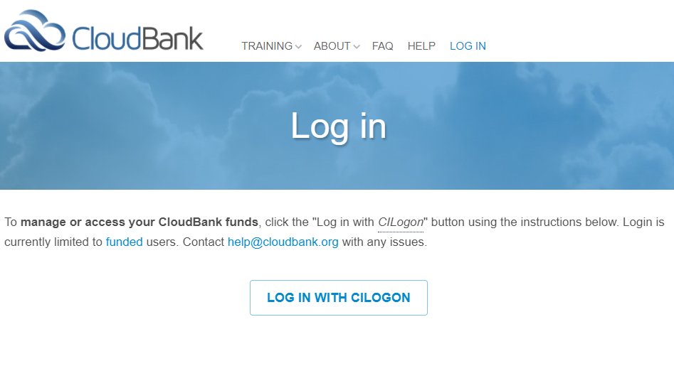
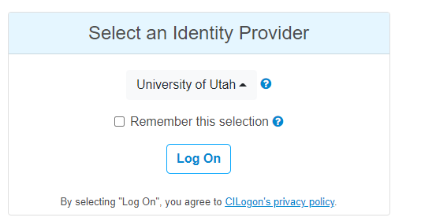
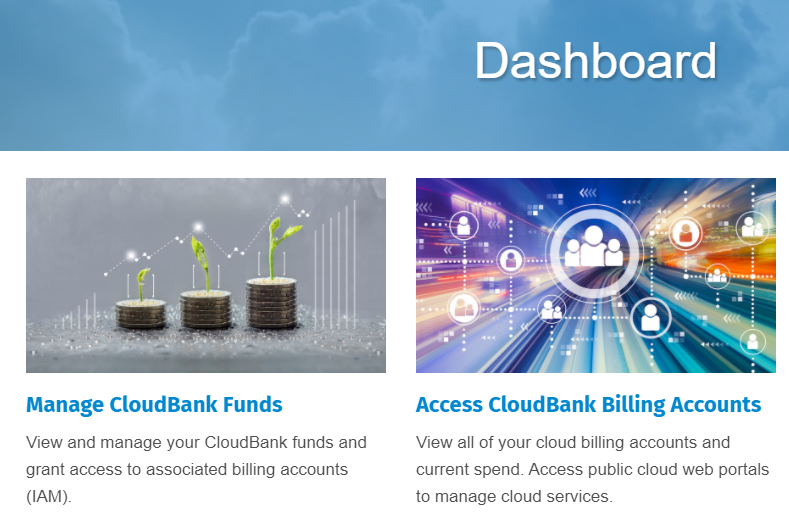
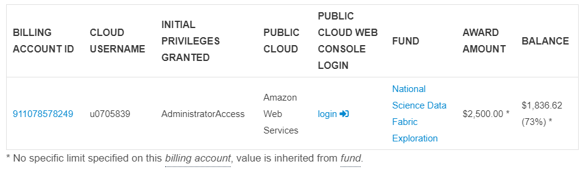

## AWS setup

Login into https://www.cloudbank.org/user/login with *CILogon*



Select your identity provider and click *Log on*. Follow your institutions instructions to complete the operation.



On the dashboard select *Access CloudBank Billing Accounts*.



Click on *login* in the billing account access.



### Create user

Go to the [IAM service](https://console.aws.amazon.com/iamv2/) and in the `Users` section add the `nsdf-automation`user with`Admininstrator` permissions (**NOTE: this is an unsafe procedure**)

```
CREDENTIAL TYPE: programmatic access
ACCESS: "Administrator Full Access"
POLICY:
{
    "Version": "2012-10-17",
    "Statement": [
        {
            "Effect": "Allow",
            "Action": "*",
            "Resource": "*"
        }
    ]
}
```

### ### Create Access Key

Click on *Security credentials* and *Create Accesss key*.

Take note of the `Access Key Id` and `Secret Access Key`. **Also remember to activate/deactivate it to avoid security problems**

### 

### Create and import SSH key

If not already generated , generate a new `id_nsdf` SSH key with an empty passphrase:

```
if [ ! -f ~/.ssh/id_nsdf ] ; then
  ssh-keygen -t rsa -f ~/.ssh/id_nsdf -N ""
fi
```

Go to *EC2* section and select *Actions/Import Key pair*:

* Name: `id_nsdf`
* Text: *copy here your public key*

### 

### Update your `vault.yml` file

Create a new item to your Vault file (i.e., `~/.nsdf/vault/vault.yml`). Change values as needed:

```
ec2-aws:  class: AmazonEC2
  access-key: XXXXX
  secret-access-key: YYYYY
  region: us-east-1
  instance-type: t2.micro
  num: 1
  image-id: ami-09e67e426f25ce0d7 # this is ubuntu20
  cidr-block: 172.16.0.0/16
  ssh-username: ubuntu
  ssh-key-name: id_nsdf
  ssh-key-filename: ~/.ssh/id_nsdf
```

# Examples

Create two new `t2.micro` Ec2 instances on `us-east-1` region:

```
alias nsdf-cloud="python3 -m nsdf-cloud"

REGION=us-east-1
nsdf-cloud ec2-aws create nodes test1 \
   --instance-type t2.micro \
   --region $REGION \
   --num 2
```

List all instances with name `test1` (**remember to use the same `--key value` argument in case services are region-specific**):

```
nsdf-cloud ec2-aws get nodes test1 --region $REGION
```

Get all AWS regions:

```
nsdf-cloud ec2-aws get regions
```

Get VPCs in one region:

```
nsdf-cloud ec2-aws get vpcs --region $REGION
```

Destroy nodes:

```
nsdf-cloud ec2-aws delete nodes test1 --region $REGION
```

### Other Helpful Snippets

If you want to **list all instances in all regions** (note: you could have some errors due to disabled regions):

```
python3 -m pip install --upgrade awscli

# insert your credentials here
export AWS_ACCESS_KEY_ID=XXXXX
export AWS_SECRET_ACCESS_KEY=YYYYY

REGIONS=$(aws ec2 describe-regions \
    --all-regions \
    --query "Regions[].{Name:RegionName}" \
    --output text)

for region in $REGIONS; do
   echo "region=$region"
   aws ec2 --region $region  describe-instances \
      --filters Name=instance-state-name,Values=running
done
```

If you want to list the `Ubuntu` images:

```
aws ec2 describe-images \
  --region $REGION \
  --filters "Name=description,Values=*ubuntu-20.0*"
```
